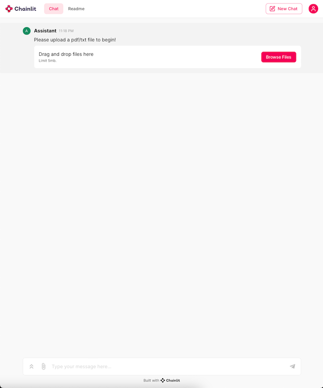
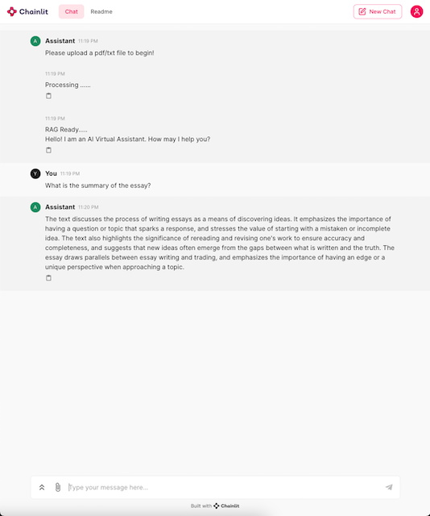

# LLAMA-INDEX-OLLAMA-CHAINLIT-RAG

## About

This project runs a local llm agent based RAG model on LlamaIndex.\
Upload files and ask questions over your documents.



Upload upto 10 files within 5 mb; max_size(5 mb) can be configured.




**LLM Used** : Ollama \
**Embedding** : HuggingFaceEmbeddings with llama-index \
**User Interface** : Chainlit

**Note** : Ollama runs on Linux or MacOS - automatically uses hardware accelerotor if available in this devices (GPU and MPS respectively), otherwise uses CPU

## Ollama setup on local device

### Mac
To install Ollama on a Mac, you need to have macOS 11 Big Sur or later. The installation process can be done in a few steps:
* **Download Ollama**: You can download Ollama for macOS from the official website.

* **Install with Homebrew**: If you prefer using Homebrew, you can install Ollama with the following command: \
    ```shell
    brew install ollama
    ```
* **Start Ollama** services on your mac, which runs on a local server which will serve all the api calls used in any llm application which will use Ollama:
    ```shell
    brew services start ollama
    ```

### Linux
For Linux users, the installation process is straightforward:

* **Install with a Single Command:** You can install Ollama using a single command by running in your terminal:
    ```shell
    curl https://ollama.ai/install.sh | sh
    ```

### Find a model to use: 
To find a model in Ollama, you can visit the [Ollama library](https://ollama.com/library?sort=popular) page. This page lists all the available models that you can pull and run locally using Ollama. 

### Download/Pull a model for Ollama:
```shell
ollama pull mistral:latest
```

Now, we are all set for writing our rag application in LlamaIndex. 

 **Note** : we can use downloaded gguf files from huggingface and use LLamaCPP or any other llm loader classes for gguf files instead of Ollama.

## Setup Enviornment

1. Clone the repo using git:

    ```shell
    git clone https://github.com/rauni-iitr/llamaindex_ollama_chainlit.git
    ```

2. Create a virtual enviornment, with 'venv' or with 'conda' and activate.
    ```shell
    python3 -m venv .venv
    source .venv/bin/activate
    ```
3. Install dependencies within the created virtual enviornment using:

    * requirements.txt:
        ```shell
        pip install -r requirements.txt
        ```
    * Manually installing packages:
        ```shell
        pip install llama-index chromadb chainlit pyyaml
        pip install llama-index-embeddings-huggingface
        pip install llama-index-llms-ollama
        pip install llama-index-vector-stores-chroma
        ```

### Your setup to run the llm app is ready.

To run the model:

```shell
chainlit run app.py
```


